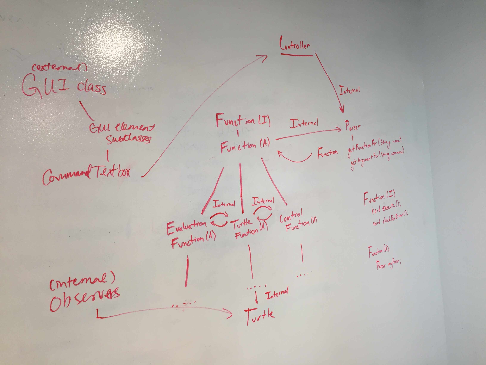

# SLogo Design: Group 16

Blake Kaplan, Amy Zhao, Annie Tang, David Yang

## Introduction

**Problem:** We are trying to create an IDE that allows users to programmatically describe designs and Turtle movements

**Primary Design Goals:** We are trying to design an IDE that is flexible in both the functions that it provides for the user and the complexity of the commands that the user can input.

**Closed:** The background the logic responsible for each command

**Open:** The commands that can be used and in which combinations

**High Level Description:** The program will repeatedly take in user input as a command string. The program will then parse the command to determine what actions to be undertaken. The program will update the model based on the commands and reflect the changes visually.

## Design Overview

The four main APIs we intend to create are an external front end API, internal front end API, external back end API, and internal back end API. The external front end API will be a Controller class, while the internal front end API will handle all input/output of the GUI components. It will have a GUIInterface class that will allow the back end to access height, width, and update the observers in our program (e.g. Turtle Observer). It will also have a GuiObjectVBox subclass that will take in user input as Strings and use an eventHandler to call the back end controller, as well as a TurtleObserver that will observe Turtle objects and use the .update() method as needed to update the view.

The internal back end API will consist of a Turtle class, a Parser class, and a Functions hierarchy, while the external back end will consist of a Controller class. Since the external back end API will be primarily for interfacing with the front end, the Controller class will hold the command history and have a processCommand() method that sends the command to a Parser object which will translate the command into a Function and its arguments via parser.getFunctionFor(command) and parser.getArgumentsFor(command) calls. The processCommand() method will then call function.execute(arguments) to enact the command. The Function object will either ultimately print something to the console or move a Turtle, in which case the .update() method will be triggered in the TurtleObserver and the view will be updated.



## User Interface

The first tab contains the bulk of what the user sees. In the top left will be a JavaFX Canvas to visualize turtle movements and transitions. It will be updated as the back end turtle functions are updated. Below that will be a TextField, where the user will be able to type in commands and define their own SLogo functions. Instead of having the text run on enter, there will be a corresponding run button, so the user can enter text on multiple lines (e.g. when defining a function) before running. This TextField will also be scrollable when the input goes past the boundaries. Below this TextField is where erroneous situations will be reported to the user (i.e. invalid data, empty data, invalid syntax, etc.). The exception handling will be printed using JavaFX class Labeled. On the upper right side of the user interface will be two different ComboBox’s. One will store the command history so that on click, the user can easily run them again. The other will store user defined commands, so again, the user can click to run. Below these two ComboBoxes will be a JavaFX TableView to store the names and values of user defined variables. The TableView allows the user to click on the value and change it dynamically. Below the TableView will be three more TextField’s. Each has a Button associated with it so that on click, the user can either A) load an image file to use for the turtle, B) enter a background color, or C) enter a pen color. Below these TextField’s will be another ComboBox, with options for setting the SLogo language.

The second tab (implemented using a TabPane) will have the HTML formatted help page.


## API Details

**Front End API Details**

For the front end external API, we created a GUIInterface that we can pass to back end for the information that we need. The interface contains three methods, getWidth(), getHeight(), and notifyAllObservers(). The back end will need to call these methods to update the Model and Turtle Observable object once they parse the commands. Once called, we can update the GUI to match the changes that the back end make to the Model. By making it an interface, we made the GUI class as closed as possible because the we are only allowing the back end to use certain methods within the GUI class.

For the front end internal API, we have a GUIObject interface that someone can use to add additional features to the GUI. The GUIObject interface contains createNode() and updateNode() methods. This interface is part of an inheritance hierarchy that contains all of the GUI elements, such as the console, the previous commands list, and so on. By creating the inheritance hierarchy, creating additional features is easy. To create a new feature, you would simply create a new subclass in the hierarchy, and the methods that you need are in the interface already. Currently, we also have a GUIFactory class to aid in creating the GUIObjects, but we may find that we won’t need this later on. This way, our code for each of the individual elements stays closed, and only the GUIFactory class would be changed when new elements need to be added. The internal API will use resource files to label all of the elements with their appropriate names.

**Back End API Details**
Follow advice from lecture, we have decided to minimize the amount of open code in API interactions. As mentioned early, all Turtle manipulations will be performed using Function subclasses. In our discussions, we noted that it will never be necessary for the view to interact directly with the Function subclasses. We also noted that the Model, View, Controller paradigm could be incredibly useful. We, therefore, decided that all View to Model interactions would happen via the Controller. Therefore, the external API between the front end and back end will happen through the Controller. When a command is typed in, the text will be given to the Controller. From there is will use internal APIs to check for errors, parse it, find the proper command and handle arguments properly. This allows our code to stay well protected yet flexible. Furthermore, the Function subclasses will be based on a Function interface which will only contain the checkForError() and execute() methods. This will allow us to make it so that these two methods will be the only ones accessible by the Controller. All internal logic will remain closed to the outside. Our internal APIs will remain as closed as possible. While there will be plenty of logic going on, the logic’s methodology will remain closed to outside classes. Lastly, interactions between the Function classes and the Turtle will remain internal to the back end. Following the Observer design pattern, the Turtle will be an observable object. We will then have Turtle observer objects that will update any time a specific Turtle experiences a change. This is an external API between the front end and the back end. Changes made on the back end will be able to trigger changes on the front end.

*List of Function subclasses:*

  * Turtle Functions

  ```
  public Fd(Turtle turtle, int dist);
  public Bk(Turtle turtle, int dist);
  public Lt(Turtle turtle, int dist);
  public Rt(Turtle turtle, int dist);
  public SetH(Turtle turtle, int degree);
  public Towards(Turtle turtle, int x, int y);
  public GoToXY(Turtle turtle, int x, int y);
  public Pd(Turtle turtle);
  public Pu(Turtle turtle);
  public St(Turtle turtle);
  public Ht(Turtle turtle);
  public Home(Turtle turtle);
  public Cs(Turtle turtle);
  public Xcor(Turtle turtle);
  public Ycor(Turtle turtle);
  public Heading(Turtle turtle);
  public PendownP(Turtle turtle);
  public ShowingP(Turtle turtle);
  ```

  * Eval Functions

  ```
  public Sum(Function expr1, Function expr2);
  public Difference(Function expr1, Function expr2);
  public Product(Function expr1, Function expr2);
  public Quotient(Function expr1, Function expr2);
  public Remainder(Function expr1, Function expr2);
  public Minus(Function expr);
  public Random(int max);
  public Sin(double degrees);
  public Cos(double degrees);
  public Tan(double degrees);
  public Atan(double degrees);
  public Log(Function expr1);
  public Pow(int base);
  public Pi();
  public LessP(Function expr1, Function expr2);
  public GreaterP(Function expr1, Function expr2);
  public EqualP(Function expr1, Function expr2);
  public NotEqualP(Function expr1, Function expr2);
  public And(Function expr1, Function expr2);
  public Or(Function expr1, Function expr2);
  public Not(Function expr1, Function expr2);
  ```

  * Control Functions

  ```
  public Make(String var, Function expr);
  public Repeat(Function expr, List<Command> commands);
  public DoTimes(String var, int limit, List<Command> commands);
  public For(String var, int start, int end, int inc, List<Command> commands);
  public If(Function expr, List<Command> commands);
  public IfElse(Function expr, List<Command> trueCommands, List<Command>falseCommands);
  public To(String commandName, List<Object> vars, List<Command> commands);
  ```
## API Example Code

**The user types 'fd 50' in the command window, and sees the turtle move in the display window leaving a trail, and the command is added to the environment's history.**

  * Assuming GUI scene has been rendered beforehand (GUI.createScene())
  * The scene contains the VBox node representation of the command window so that once the user enters in text and clicks the run Button, the event handler calls:
      * Controller.processCommand(textFieldInput.getText());   
        * processCommand() will call
          * Parser.parseCommand(String commandString) which will return a Command object -> command.execute() calls fd.execute(50)
            * The forward function will move the Turtle’s position forward by 50 in increments of 1
            * In response to the Turtle’s movement, the .update() method of the TurtleObersever will be called, and a chain of updateNode() methods is then initiated. This chain updates the TurtleCanvas.
          * addToHistory(String commandString) for a successfully executed function


**Later on as an extension, a VBox needs to be added to the UI**

  * GUI.createScene() creates the scene, and within this method, all the objects are laid out in position
  * GUIObject.createNode(Controller c, String nodeType)
  * GUIObjectFactory.createNewGuiObject(String nodeType) is called, and the correct object, in this case a VBox is created.

**The user loads an invalid image to use for the turtle.**

  * Assuming scene has been rendered and GUIObjectVBox for loading turtle image has been added to scene
  * On click, the button to load the file will call handleImageInput(textFieldInput.getText()) on the invalid text field input
  * Within this method will call isValidImage(String textInput)
  * If the image cannot be found or is not of the right format (jpeg, png, etc.), errors will be printed to the UI as Labeled objects. e.g. “Sorry, image could not be found.” or “This is not a valid image format.”

**The user types ‘pu fd 50 pd fd 50’ in the command window**

  * The Vbox node representing the command node will receive this input string, which will trigger an event handler
  * Event handler calls:
    * Controller.processCommand(textFieldInput.getText())
    * the processCommand() method will call:
      * Parser.parseCommand(String commandString), which will return a List of Command objects
      * the method will iterate over the List of Command objects to execute them in order and call addToHistory(Command.toString()) after each one
        * pu will be executed (pu.execute(turtle)) to change the turtle’s penUp boolean to true
        * fd 50 will be executed (fd.execute(50, turtle)) to change the turtle’s position incremently
        * front end TurtleObserver’s .update() method will check for pen up and move the turtle with no trail
        * pd will be executed (pd.execute(turtle)) to change the turtle’s penUp boolean to false
        * fd 50 will be executed (fd.execute(50, turtle)) to change the turtle’s position incremently
        * front end TurtleObserver’s .update() method will check for pen up, find it to be false, and move the turtle with a trail

**User types in ‘50 fd’**

  * The Vbox node representing the command node will receive this input string, which will trigger an event handler
  * Event handler calls Controller.processCommand(textFieldInput.getText())
  * the processCommand() method will call:
    * Parser.parseCommand(String commandString), find no function matching ‘50’, and return an error to the UI

## Design Considerations

**Back end Design Considerations**

For the back end, issues we considered when building our design were how the model’s changes would be reflected on the view, how to initiate the processing of a command once one is inputted by a user, and how to enforce flexibility for both functions and turtles.

In discussing the best way to pass info between the model and the view, we wanted both the model and the view to have to interact as little as possible, while still being able to visualize all details of the turtle’s movement. We considered (1) creating a Model object that would be passed to the view once a command was processed, and then the view would decide how to move from the old state to the new state of the Model, (2) having the back end call front end functions (e.g. have the back end call turtle.move() which would render a turtle at a new location on the canvas), or (3) using the Observer pattern. Ultimately, we decided that solution 1 wouldn’t be able to determine and visualize the intermediate path between state 1 and state 2, and that solution 2 would unnecessarily clutter the external APIs and create dependencies. The Observer pattern provides automatic updating based on the Observable Object so no part of the back end will have to programmatically interact with the front end, making it seem like the cleanest way to go about this.

In determining how to initiate the back end processing of the commands, we were deciding between having the back end Controller get the command string from the command line by polling for input or having the front end CommandLine have an event handler for user input. Initially, it seemed that it would make sense for the Controller to poll for it because it is controlling the execution flow of the command, but this would also increase wasted overhead by polling unnecessarily. JavaFx’s event handlers are well-suited to handling thread dependencies so using an event handler from the CommandLine seemed to be a better design.

As far as enforcing flexibility for both Functions and Turtle objects, we wanted to keep the two as separate as possible. We decided to make a Turtle class that can later be extended to create more types of turtles if desired, and an inheritance hierarchy for the Functions classes. All Functions class will have an execute() method in common, and from there we split them into three more classes based on their input arguments and their output to better take advantage of commonalities (i.e. TurtleFunctions, EvalFunctions, and ControlFunctions). We considered having all MathFunctions be held in one class and all TurtleFunctions be held in another for conciseness, but ultimately decided it would be more extensible if we made each function its own subclass within the hierarchy because then adding a new command function would simply require creating a clean new class.

**Front end Design Considerations**

For the front end, we had to decide how the GUI elements would be organized. We decided between using an abstract class GUIObject intermediary below the interface, but we decided that it wasn’t necessary because we could just pass the interface to the GUI class. This would allow for the same amount of flexibility and less code. Additionally, we decided to add in abstract classes for each of the javafx Node types that were going to be added to the GUI. We decided to do this because there would be some overlapping code among classes that created the same type of node. If we find out that there isn’t any shared code among them, then we may decide to remove the abstract type classes.

Another design decision that we made was to add a GUIObjectFactory class that would create the Node type based on an input string. We decided to add this class because it was the easiest way for the code to specify which Node to create. We also do not know for sure that this class is needed, but we added it in the initial design to be safe. This causes the creation of Nodes to be outside of the GUIObject interface and uses many switch/if statements, so we will try to avoid this design if we can.


## Team Responsibilities

**Amy/Blake** - first write Turtle, Controller, EvalFunctions, TurtleFunctions classes, then one will work on Parser and one will work on ControlFunctions

**Annie/David** - write GUIInterface, GUI, Controller clases, work on GUIObject (Interface) and its subclasses (GOVbox, GOComboBox, GOTableView, GOCanvas, GOLabelled).
