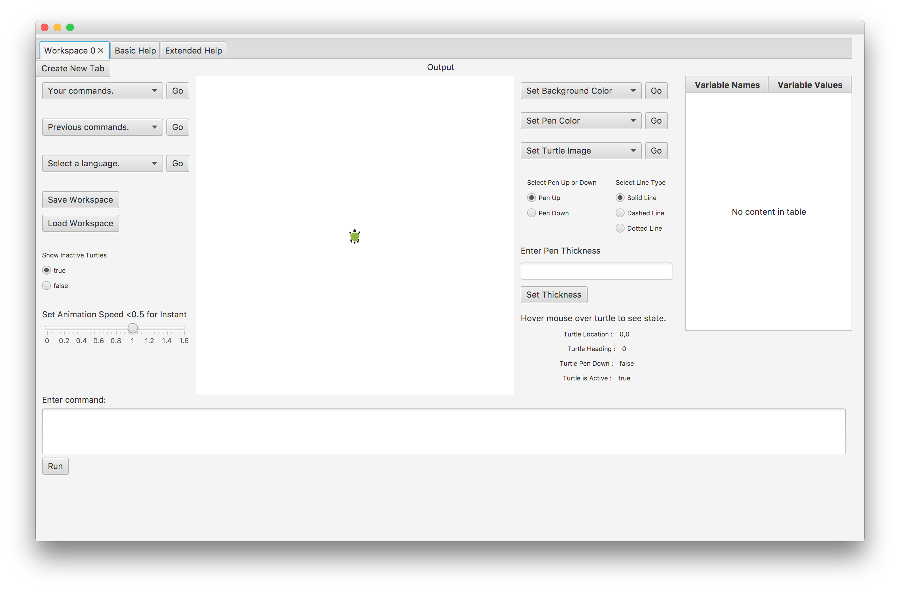

#SLogo 
Third Project for CompSci 308 Spring 2016

**Description**

SLogo is a simplified Logo IDE. Our project allows users to input commands to move a turtle figure. This required our team to both interpret provided commands and visually reflect the appropriate changes to the turtle. 

Our project also allows for significant user customization. Users can change the turtle image, the line color, the background color, and how fast the turtle moves. Users are also able to define custom commands and store variable values.

In addition, our project has scoped variables, multiple workspace tabs, and support for recursive commands.

The image below shows our project UI:

